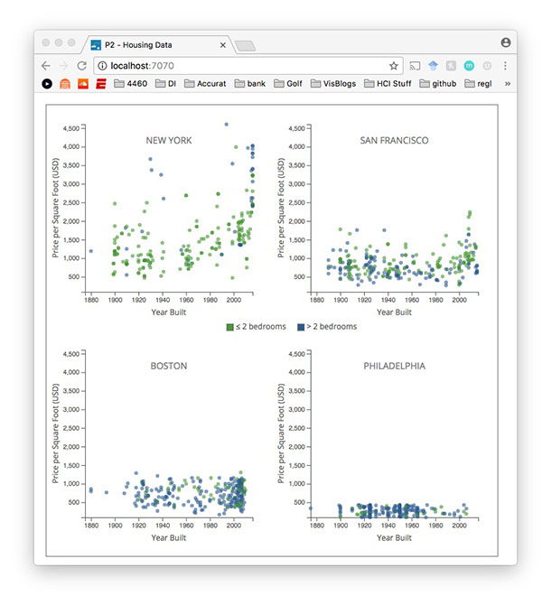

**Due Friday October 27th, 12 Noon**

[CS 4460 - Information Visualization](http://www.cc.gatech.edu/~stasko/4460) - Fall 2017

***

# Programming Assignment 2: Trellis Scatterplot

### Instructions

In this assignment you will create a trellis scatterplot. The trellis display consists of 4 charts, each showing **real estate data for 4 cities.** Your submission should create a web page that looks like this:

You will use the dataset at `./data/real_estate.csv` to create the trellis display. Here is a snippet of the dataset:

| `location`    |`beds`|`bath`|`price`  |`year_built`|`sqft`|`price_per_sqft`|
|---------------|------|------|---------|------------|------|----------------|
| New York      | 2    | 1    | 999000  | 1960       | 1000 | 999            |
| New York      | 2    | 2    | 2749502 | 2006       | 1418 | 1939           |
| San Francisco | 2    | 1    | 875448  | 1908       | 1158 | 756            |
| Boston        | 3    | 2    | 1605468 | 1911       | 1588 | 1011           |
| Boston        | 3    | 2    | 1514496 | 1924       | 1536 | 986            |

For those interested, [the NY & SF portion of this dataset](https://github.com/jadeyee/r2d3-part-1-data) comes from the [r2d3 - A visual introduction to machine learning](http://www.r2d3.us/visual-intro-to-machine-learning-part-1/) storytelling visualization. Take a look, the authors use beautiful animations and transitions to explain ML classification.

Back to the matter at hand - you will use this dataset to create the above trellis scatterplot. First, you will need to group or nest the dataset by the `location` data attribute [`San Francisco`, `New York`, `Boston`, `Philadelphia`]. Like in **P1**, you will need to re-configure the data for the `location` data attribute.

For this assignment, you are **required to accomplish this with the d3.nest() function.** Hopefully, you mastered it last week in [P1](https://github.gatech.edu/CS-4460/Homework/wiki/P1%3A-Static-Chart) and during [Lab 5](https://github.gatech.edu/CS-4460/Labs/wiki/Lab-5%3A-D3-Selections-%26-Grouping).

Then you will need to create each 4 trellis plots and lay them out in a uniform way. Look to [Lab 5](https://github.gatech.edu/CS-4460/Labs/wiki/Lab-5%3A-D3-Selections-%26-Grouping) where we covered how to accomplish nested selections and grouping.

> Reminder that this is an individual assignment. The code you turn in should be your own creation. You are certainly welcome to seek assistance from the TAs as you work on the assignment, however.

### Starter code

All of the starter code for the Programming Assignments can be found at the [HW Github Repository](https://github.gatech.edu/CS-4460/Homework). `git clone` this repository for this assignments starter code. You will need to `git pull` for all future starter code.

**You are required to use the starter code for all programming assignments.**

### What to turn in

You will submit your code via T-Square. Compress your code (the `02_trellis_scatterplot` directory) into a zip file. Upload and submit this zip file via T-Square.

### Deadline

Your zipped code should be submitted to T-Square by **12 Noon on Friday October 27th**

### Grading

This assignment will be graded out of a 100 point scale. If your D3 code does all of the following you will receive all 100 points:

1. Creates a trellis scatterplot with 4 subplots that show the required data from the instructions - we will check to make sure the subplots are data accurate.
2. Your code processes the raw data to create a nested data structure for the trellis plot. `d3.nest()` is required to accomplish this - you will lose points if you do not use `d3.nest()`.
3. You are required to add labels and axes for both charts.
4. You created a trellis scatterplot, and not just 4 separate scatterplots. **This requires that all subplots use the same scales.**

You will not **lose points** on any of the following:

1. The styling of the charts, axes or labels
2. The colors you decide to use
3. The spacing or width of the subplots
4. Conventions or legibility of your code
5. Handling any other datasets than `./data/real_estate.csv`

**Extra Credit**

We will be giving up to **10 points** of extra credit for styling your charts. Or any useful feature that enhances your visualization. Please make note of the extra credit in the notes of your T-Square submission.
